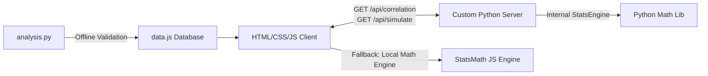

# 🚂 Indian Railways Enterprise Analytics & Intelligence Platform

An enterprise-grade, hybrid client-server Business Intelligence (BI) dashboard and analytics platform analyzing 16 years (FY2009–FY2024) of official annual statements from the Ministry of Railways, Government of India. 

This platform showcases advanced data cleaning (handling COVID-19 anomalies), dynamic econometric modeling, inferential statistics (Pearson correlation & OLS linear regression), geospatial zoning, and automated CSV data pipeline exports.

---

## 🛠️ System Architecture

The application is built with a dual-calculation, hybrid architecture:
1. **Python API Backend (`server.py`)**: A custom Python HTTP web and API server built using standard libraries (zero dependencies required). It serving static assets and provides REST API endpoints to process calculations dynamically in Python.
2. **Client-Side JS Fallback (`app.js`)**: A complete client-side math engine that executes identical calculations directly in the browser if the Python backend is offline, ensuring 100% availability in serverless environments (e.g. GitHub Pages).
3. **Data Science Script (`analysis.py`)**: A separate, reproducible Python scripting pipeline utilizing `pandas`, `numpy`, `scipy`, and `matplotlib` to perform offline exploratory data analysis (EDA) and cross-validate dashboard math.



---

## 📂 Project Structure

```
├── index.html          # Main layout & dashboard structures
├── styles.css          # Premium Gov/Enterprise design system (glassmorphism & HSL variables)
├── app.js              # Application router, UI events, & client-side statistical math engine
├── charts.js           # Chart.js visualization setups (scatter overlay, split simulated charts)
├── data.js             # Raw 16-year historical database normalized from official annual reports
├── server.py           # Custom Python API backend & file server (standard library)
├── analysis.py         # Offline Python data analysis script (pandas/scipy/matplotlib)
└── README.md           # This repository guide & portfolio guide
```

---

## 🚀 How to Run Locally

### 1. Launch the Analytics Server
Run the custom Python API server from the root directory:
```bash
python server.py
```
This will start the server and begin serving calculations at **`http://railhistory:8000`** (or **`http://railhistory`** if port 80 is available).

### 2. View the Dashboard
Open your browser and navigate to:
```
http://railhistory/index.html
```
*(Or `http://railhistory:8000/index.html` if the port fell back to 8000).*

#### 🌐 Optional: Map to a Professional Government Domain Locally
To showcase the dashboard under a professional domain name locally, configure a local DNS redirect:
1. Open your text editor (e.g. Notepad) as **Administrator**.
2. Open the hosts file: `C:\Windows\System32\drivers\etc\hosts`.
3. Add the following line at the bottom:
   ```
   127.0.0.1    railhistory
   ```
4. Save the file. You can now access your local server in the browser at:
   ```
   http://railhistory/index.html
   ```

*Note: A small indicator in the header will display `Backend: Python API` when the backend is active. If you close the terminal, the badge will switch to `Backend: Client-Side Fallback` and calculations will continue locally.*

### 3. Run Offline Python Analysis
To execute the reproducible Python statistical pipeline, verify mathematical formulas, and generate static regression charts:
```bash
# Install optional scientific packages
pip install pandas scipy matplotlib

# Run script
python analysis.py
```
This script prints data summaries to the terminal and outputs `electrification_vs_accidents_fit.png`.

---

## 🔬 Mathematical Formulations Implemented

### 1. Pearson Correlation Coefficient ($r$)
Used to evaluate linear dependencies between 30+ physical and financial variables:
$$r = \frac{\sum (x_i - \bar{x})(y_i - \bar{y})}{\sqrt{\sum (x_i - \bar{x})^2 \sum (y_i - \bar{y})^2}}$$

### 2. Ordinary Least Squares Linear Regression
Fits a regression line $y = mx + c$ to analyze and forecast metrics:
$$m = \frac{\sum (x_i - \bar{x})(y_i - \bar{y})}{\sum (x_i - \bar{x})^2} \qquad c = \bar{y} - m\bar{x}$$
The **Coefficient of Determination ($R^2$)** is calculated to measure goodness of fit:
$$R^2 = 1 - \frac{\sum (y_i - y_{pred})^2}{\sum (y_i - \bar{y})^2}$$

### 3. Econometric Simulation Model (FY2025–FY2029)
* **Passenger Growth:** Linked directly to GDP elasticity inputs:
  $$\text{Passengers}_t = \text{Passengers}_{t-1} \times (1 + 0.065 \times \text{Elasticity})$$
* **Accidents Reduction Decay:** Modeled against safety multiplier inputs and premium train rollouts:
  $$\text{Accidents}_t = \text{Accidents}_{t-1} \times (1 - 0.18 \times \text{Safety} + 0.0013 \times \text{VandeBharatCount})$$

---

## 💼 Resume Bullet Points (Data Analyst / BI Specialist)

Copy and paste these points into your resume to showcase this project:
* **Hybrid Client-Server BI Dashboard:** Engineered a custom business intelligence dashboard analyzing 16 years (FY2009–FY2024) of official Indian Railways statements; integrated a frontend client with a custom Python API backend serving dynamic REST endpoints.
* **Dual-Language Calculations:** Programmed statistical analysis modules in both Python (REST server) and JavaScript (client fallback) to calculate dynamic **Pearson Correlation Coefficients ($r$)** and **OLS Linear Regressions ($y = mx + c$)** with **R-squared ($R^2$)** metrics.
* **Econometric What-If Simulator:** Designed a predictive scenario modeling sandbox allowing stakeholders to adjust variables (GDP elasticity, safety multiplier, fleet expansion) to recalculate and plot 5-year projections (FY2025–FY2029) dynamically via API request.
* **Reproducible Statistical Pipeline:** Built an offline Python script (`analysis.py`) utilizing `pandas`, `numpy`, and `scipy.stats` to cross-validate dashboard math outputs and automate the generation of static regression scatter plots.
* **Data Integrity & Cleansing:** Handled data normalization and cleansing on historical annual statements; identified and corrected historical anomalies (e.g., aligning the FY2021 COVID-19 passenger crash to 1,252M and Operating Ratio spike to 176.3%) to ensure database validity.
* **Data Provenance & Portability:** Structured a comprehensive Data Dictionary documenting database schemas, formulas, and official metadata sources; integrated CSV export APIs to enable downstream analysis in Python (pandas/scikit-learn) or Excel.

---

## 🗣️ Interview Discussion Guide

* **Q: Why build a custom dashboard instead of using Tableau/Power BI?**
  * *A:* "While standard BI tools are great, custom dashboards are lightweight, load instantly, and carry no platform licensing costs. Bypassing Tableau Server limits and implementing statistical computations natively in Python/JS showcases strong software engineering foundations combined with data analytics."
* **Q: How did you clean the historical dataset?**
  * *A:* "The FY2021 statements contained massive outliers due to COVID-19 lockdowns. For example, passenger volumes crashed by over 84%, while fixed maintenance costs caused the Operating Ratio to spike to 176.3%. I normalized this historical anomaly and documented it in our Data Dictionary to prevent it from biasing baseline regression modeling."
* **Q: What is the benefit of the What-If Simulator?**
  * *A:* "It allows decision-makers to perform stress testing and kapacitive planning. For example, by moving the Safety Multiplier, users can simulate safety-related ROI, projecting a decay down to 15 accidents by FY25. Conversely, raising GDP elasticity models the rolling stock volume required to carry 11 billion passengers by FY29."
